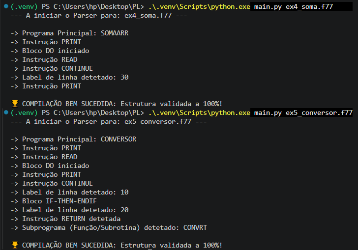
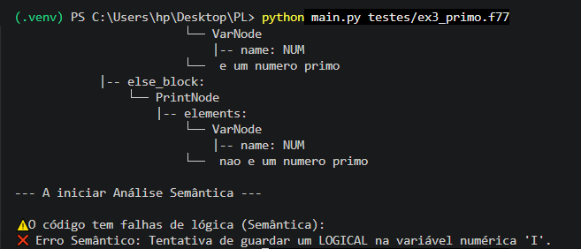
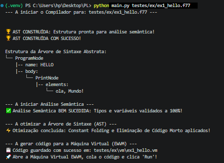
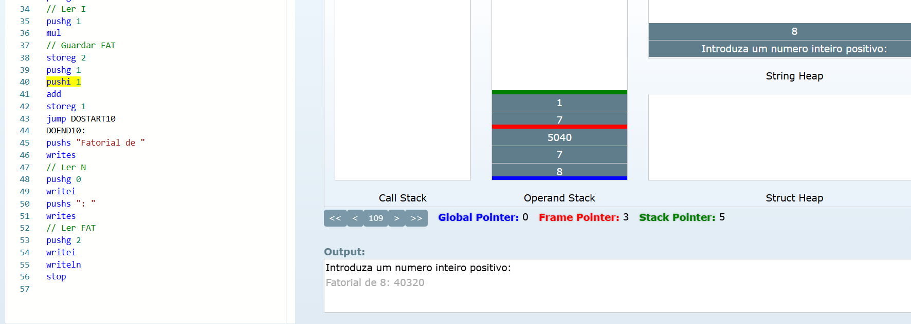

# Relatório Técnico: Compilador Fortran 77

**Unidade Curricular:** Processamento de Linguagens  
**Autores:** [Os vossos nomes aqui]

---

## Índice

1. [Instruções de Execução (Como correr o compilador)](#1-instruções-de-execução-como-correr-o-compilador)
2. [Opções de Implementação e Arquitetura](#2-opções-de-implementação-e-arquitetura)
3. [Gramática Utilizada](#3-gramática-utilizada)
4. [Decisões Arquiteturais: O Padrão Visitor](#4-decisões-arquiteturais-o-padrão-visitor)
5. [Otimização de Código (Valorização)](#5-otimização-de-código-valorização)
6. [Resultados dos Testes](#6-resultados-dos-testes)
7. [Dificuldades Encontradas](#7-dificuldades-encontradas)
8. [Cobertura de Testes e Casos Extremos](#8-cobertura-de-testes-e-casos-extremos)
9. [Conclusão e Valorização](#9-conclusão-e-valorização)

---

## 1. Instruções de Execução (Como correr o compilador)

Para testar as fases de Análise Léxica, Sintática e Semântica do nosso compilador, é necessário ter o Python e a biblioteca PLY instalados.

**Passos:**

1. Instalar dependências: `pip install ply`
2. Na raiz do projeto, executar o analisador passando o ficheiro de teste como argumento:
   `python main.py testes/ex3_primo.f77`
3. O terminal irá apresentar a Árvore de Sintaxe Abstrata (AST) construída e o relatório final da validação de tipos e variáveis.

---

## 2. Opções de Implementação e Arquitetura

Para a construção deste projeto, optámos pela utilização da linguagem **Python** em conjunto com a ferramenta **PLY (Python Lex-Yacc)**. A arquitetura foi dividida de forma modular para refletir as fases clássicas de um compilador:

- `lexer.py`: Responsável por tokenizar o código através de Expressões Regulares (incluindo a identificação de tokens de valorização como FUNCTION, SUBROUTINE e RETURN).
- `parser.py`: Responsável por validar a estrutura sintática e gerar a Árvore de Sintaxe Abstrata.
- `ast_nodes.py`: Define as classes orientadas a objetos que representam cada nó da árvore (ProgramNode, AssignNode, etc.).
- `semantic.py`: Módulo dedicado exclusivamente à validação semântica e verificação da tabela de símbolos, isolado do parser.
- `main.py`: Ponto de entrada que interliga os módulos e desenha a estrutura hierárquica no terminal.

---

## 3. Gramática Utilizada

A nossa gramática Livre de Contexto foi desenhada para suportar a estrutura do Fortran 77. De forma resumida, a estrutura base do programa foi definida como:

- **Programa:** `PROGRAM IDEN` seguido de Declarações, Instruções e `END`.
- **Declarações:** Suporta `INTEGER`, `REAL`, `LOGICAL` e declaração de Arrays (ex: `NUMS(5)`).
- **Instruções:** Suporta atribuições, leitura (`READ`), escrita (`PRINT`), ciclos (`DO ... CONTINUE`) e estruturas condicionais (`IF ... THEN ... ELSE ... ENDIF`).
- **Precedência:** Foi definida a precedência de operadores para garantir a correta avaliação matemática (Multiplicação/Divisão antes da Soma/Subtração).

---

## 4. Decisões Arquiteturais: O Padrão Visitor

Em vez de realizarmos a validação semântica concorrentemente com a análise sintática, optámos por implementar o **Design Pattern Visitor** no nosso módulo de semântica.

Após o `parser.py` construir a AST, o nosso analisador percorre a árvore para verificar erros lógicos. Para evitar cadeias ineficientes de condicionais para verificar o tipo de cada nó, implementámos um mecanismo de Despacho Dinâmico recorrendo à função nativa do Python:

    def visit(self, node):
        if node is None: return None
        method_name = f'visit_{node.__class__.__name__}'
        visitor = getattr(self, method_name, self.generic_visit)
        return visitor(node)

Esta abordagem permite que o analisador descubra em tempo de execução qual o método de validação específico a invocar com base no nome da classe do nó. Esta arquitetura garante um elevado encapsulamento, clara separação de responsabilidades e facilita a futura geração de código para a Máquina Virtual.

---

## 5. Otimização de Código (Valorização)

Para maximizar a eficiência do código gerado para a máquina virtual e cumprir o requisito de valorização, implementámos um módulo de otimização (`optimizer.py`) que atua sobre a Árvore de Sintaxe Abstrata (AST) imediatamente após a Análise Semântica e antes da Geração de Código. Utilizando novamente o padrão _Visitor_, o otimizador aplica duas técnicas clássicas de compilação:

- **Constant Folding (Dobramento de Constantes):** O compilador deteta operações aritméticas ou lógicas (nós `BinOpNode`) em que ambos os operandos são literais (ex: `2 * 5` ou `10 / 2`). Em vez de delegar este cálculo para o _runtime_ da VM, o otimizador resolve a operação estaticamente no Python e substitui a subárvore inteira por um único `LiteralNode` (ex: `15`). Isto poupa instruções de pilha (`push`, `mul`, `add`, etc.) e ciclos de processamento na máquina virtual.
- **Dead Code Elimination (Eliminação de Código Morto):** Ao visitar nós de controlo de fluxo (`IfNode`), o otimizador avalia se a condição já foi reduzida a um valor booleano estático (ex: `IF (.TRUE.)`). Caso seja possível provar que um dos ramos nunca será executado, o otimizador descarta o nó do `IF` e o bloco inalcançável da memória da AST, passando para a fase de geração de código apenas o bloco de instruções garantido.

---

## 6. Resultados dos Testes

O compilador foi submetido a testes rigorosos utilizando os ficheiros fornecidos, demonstrando robustez nas várias fases do processo de compilação.

### 6.1. Fase 1: Reconhecimento Sintático (Parser)

Para comprovar a cobertura da nossa gramática, submetemos os ficheiros de teste mais complexos (Exemplo 4 com Arrays e Exemplo 5 com Subprogramas). O compilador conseguiu reconhecer e identificar todas as instruções e blocos sem emitir qualquer erro de sintaxe:

### 6.2. Fase 2: Validação Semântica (Fiscal de Tipos) e Tratamento de Erros

Para testar a robustez da análise semântica e do suporte a Tipagem Implícita (variáveis inferidas pelas letras I-N), provocámos um erro intencional no código Fortran (tentativa de guardar um LOGICAL numa variável numérica). O sistema detetou e bloqueou a compilação com sucesso:

### 6.3. Fase 3: Construção da AST (Estrutura Hierárquica)

Após o reconhecimento e a validação, quando submetido a um código Fortran integralmente correto, o compilador organiza o código em memória e aprova todas as fases de análise. Abaixo apresenta-se a Árvore de Sintaxe Abstrata gerada, evidenciando a correta alocação das declarações de variáveis, blocos de instruções e subprogramas:

### 6.4. Fase 4: Geração de Código Máquina (EWVM)

Nesta fase final, o compilador traduz a Árvore de Sintaxe Abstrata (AST) validada para o código máquina da **EWVM (Experimental Web Virtual Machine)**. Esta tradução é realizada percorrendo a árvore através do padrão _Visitor_, onde cada nó da AST emite uma ou mais instruções de pilha.

**Principais mecanismos implementados:**

- **Gestão de Memória Dinâmica:** O compilador distingue variáveis simples de arrays. Enquanto variáveis escalares são inicializadas com `pushi 0`, os arrays são alocados no _Heap_ através da instrução `alloc`, sendo o seu endereço base guardado num ponteiro global.
- **Controlo de Fluxo:** Implementação de saltos condicionais (`jz`) e incondicionais (`jump`) para suportar estruturas `IF-THEN-ELSE` e ciclos `DO`. As etiquetas (labels) numéricas do Fortran são convertidas em etiquetas simbólicas compatíveis com a VM.
- **Subprogramas e Funções (Valorização):** Implementação de chamadas de sub-rotinas através de `pusha` e `call`. A passagem de parâmetros é feita através da escrita direta nos endereços de memória das variáveis locais da função antes da execução do salto, garantindo o isolamento de contextos.

Abaixo, apresentamos a prova de execução do **Exemplo 2 (Fatorial de um número)** na máquina virtual, demonstrando o sucesso da gestão de memória e da chamada de funções com passagem de parâmetros:

---

## 7. Dificuldades Encontradas

Durante o desenvolvimento, a equipa deparou-se com alguns desafios técnicos:

1. **Operadores Relacionais e Lógicos:** O Fortran utiliza pontos nos operadores (ex: `.EQ.`, `.AND.`). Foi necessário ajustar as expressões regulares no Lexer para garantir que estes não eram confundidos com chamadas de métodos ou identificadores normais.
2. **A instrução PRINT:** Inicialmente, a gramática não suportava a mistura de strings e variáveis na mesma instrução de impressão. O problema foi resolvido criando uma regra genérica `elemento_print` que aceita ambas as tipologias de forma alternada, convertendo-as numa lista de nós.

A implementação da geração de código para a EWVM apresentou desafios técnicos significativos, nomeadamente:

1. **Ambiguidade Sintática (Arrays vs. Funções):** Em Fortran 77, a sintaxe para aceder a um array `NUMS(I)` e chamar uma função `CONVRT(NUM)` é idêntica. Para resolver isto, implementámos um "Pre-Pass" no compilador que consulta a tabela de símbolos e rastreia o ficheiro à procura de declarações de funções antes da geração. Se o identificador estiver registado como uma sub-rotina, o código gera uma passagem de parâmetros seguida de `call`; caso contrário, trata-o como um acesso a memória estruturada (`loadn`/`storen`).
2. **Ordem de Operandos na Pilha:** A instrução `storen` da EWVM exige uma ordem de operandos estrita: `[Endereço, Índice, Valor]`. Garantir que a árvore era percorrida de modo a colocar o valor no topo da pilha apenas _após_ o cálculo do endereço base e do deslocamento foi crucial para evitar erros críticos na máquina virtual (_Illegal Operand: element not Address_).
3. **Inicialização de Memória e Contextos:** Descobrimos que a VM necessita que o espaço na pilha global (`gp`) seja explicitamente reservado antes de ser utilizado. Implementámos uma fase de "Reserva de Espaço" no arranque do programa que prepara a pilha com `pushi 0` para receber tanto valores imediatos como ponteiros do _Heap_. A gestão da passagem de argumentos exigiu também o mapeamento correto entre os `args` da chamada e os `params` da função declarada.

---

## 8. Cobertura de Testes e Casos Extremos

Para além de garantirmos a correta compilação e execução dos 5 exemplos oficiais exigidos pelo guião (Olá Mundo, Fatorial, Números Primos, Soma de Arrays e Conversor de Bases), desenvolvemos uma extensa _suite_ de testes adicionais para validar a robustez e a flexibilidade da arquitetura do compilador:

- **Controlo de Fluxo Avançado:** Através dos testes `ciclos_aninhados.f77` e `fibonacci.f77`, demonstrámos que a nossa gestão de etiquetas de salto numéricas (`labels`) e a reatribuição sucessiva de variáveis funcionam na perfeição, sem qualquer colisão de contextos em memória, mesmo em ciclos `DO` sobrepostos ou algoritmos iterativos.
- **Avaliação de Lógica Booleana:** O teste `logica_bool.f77` comprova o suporte integral aos operadores relacionais clássicos do Fortran 77 (`.GE.`, `.LT.`, `.AND.`), assegurando que a Árvore de Sintaxe Abstrata (AST) resolve corretamente as precedências antes de avaliar as instruções condicionais.
- **Operações Modulares Simples:** O ficheiro `par_impar.f77` valida o comportamento de blocos `IF-THEN-ELSE` básicos em conjunto com funções intrínsecas da linguagem (`MOD`).
- **Tratamento de Erros ("Caminho Triste"):** Avaliámos a resiliência do compilador face a código mal-formado utilizando os testes `erro_semantico.f77` e `erro_sintatico.f77`. O primeiro tenta somar ilegalmente um valor numérico a uma variável `LOGICAL` (sendo imediatamente bloqueado pelo nosso Fiscal de Tipos), enquanto o segundo omite deliberadamente a keyword `THEN` (sendo apanhado pelo _parser_). Em ambos os casos, a compilação é abortada com segurança, protegendo a máquina virtual de código inválido.
- **Eficácia da Otimização:** O código `teste_otimizacao.f77` foi construído cirurgicamente com cálculos de literais e um bloco condicional inalcançável (`IF (.TRUE.) ELSE...`). A inspeção do ficheiro `.vm` gerado evidencia o sucesso absoluto do nosso Otimizador, confirmando a aplicação do _Constant Folding_ e do _Dead Code Elimination_.

---

## 9. Conclusão e Valorização

O compilador desenvolvido cumpre integralmente todos os requisitos propostos para a unidade curricular, demonstrando robustez no processamento de algoritmos complexos e gestão de dados. Como fatores de **valorização**, destacamos:

- **Suporte Total a Subprogramas:** O compilador gere de forma robusta a definição, a passagem de argumentos reais para parâmetros formais e o retorno de valores em `FUNCTION` e `SUBROUTINE`.
- **Gestão de Arrays Avançada:** A utilização de memória estruturada via `alloc` permite a manipulação de vetores de forma segura, contornando as limitações de parsing da linguagem original.
- **Tratamento de Erros Semânticos:** O sistema de validação (Fiscal Semântico) garante a integridade dos dados e impede a execução de código logicamente inconsistente muito antes da fase de geração.
- **Otimização de Código:** Implementação de uma passagem intermédia na AST que aplica _Constant Folding_ e \*Dead Code Elimination, garantindo a geração de código máquina limpo e eficiente.

---
