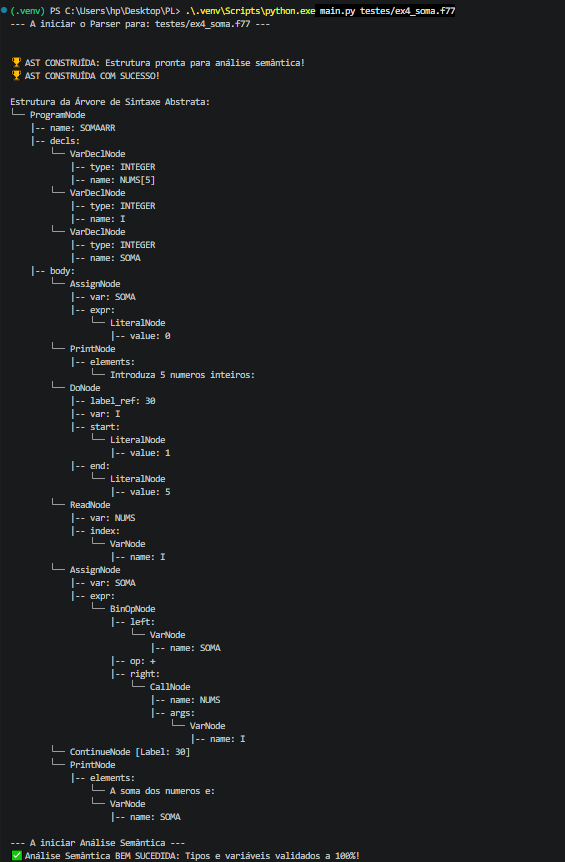

# Relatório Técnico: Compilador Fortran 77

**Unidade Curricular:** Processamento de Linguagens  
**Autores:** [Os vossos nomes aqui]

---

## Índice

- [1. Instruções de Execução (Como correr o compilador)](#1-instruções-de-execução-como-correr-o-compilador)
- [2. Opções de Implementação e Arquitetura](#2-opções-de-implementação-e-arquitetura)
- [3. Gramática Utilizada](#3-gramática-utilizada)
- [4. Decisões Arquiteturais: O Padrão Visitor](#4-decisões-arquiteturais-o-padrão-visitor)
- [5. Dificuldades Encontradas](#5-dificuldades-encontradas)
- [6. Resultados dos Testes](#6-resultados-dos-testes)

---

## 1. Instruções de Execução (Como correr o compilador)

Para testar as fases de Análise Léxica, Sintática e Semântica do nosso compilador, é necessário ter o Python e a biblioteca PLY instalados.

**Passos:**

1. Instalar dependências: `pip install ply`
2. Na raiz do projeto, executar o analisador passando o ficheiro de teste como argumento:
   `python main.py testes/ex3_primo.f77`
3. O terminal irá apresentar a Árvore de Sintaxe Abstrata (AST) construída e o relatório final da validação de tipos e variáveis.

---

## 2. Opções de Implementação e Arquitetura

Para a construção deste projeto, optámos pela utilização da linguagem **Python** em conjunto com a ferramenta **PLY (Python Lex-Yacc)**. A arquitetura foi dividida de forma modular para refletir as fases clássicas de um compilador:

- `lexer.py`: Responsável por tokenizar o código através de Expressões Regulares (incluindo a identificação de tokens de valorização como FUNCTION, SUBROUTINE e RETURN).
- `parser.py`: Responsável por validar a estrutura sintática e gerar a Árvore de Sintaxe Abstrata.
- `ast_nodes.py`: Define as classes orientadas a objetos que representam cada nó da árvore (ProgramNode, AssignNode, etc.).
- `semantic.py`: Módulo dedicado exclusivamente à validação semântica e verificação da tabela de símbolos, isolado do parser.
- `main.py`: Ponto de entrada que interliga os módulos e desenha a estrutura hierárquica no terminal.

---

## 3. Gramática Utilizada

A nossa gramática Livre de Contexto foi desenhada para suportar a estrutura do Fortran 77. De forma resumida, a estrutura base do programa foi definida como:

- **Programa:** `PROGRAM IDEN` seguido de Declarações, Instruções e `END`.
- **Declarações:** Suporta `INTEGER`, `REAL`, `LOGICAL` e declaração de Arrays (ex: `NUMS(5)`).
- **Instruções:** Suporta atribuições, leitura (`READ`), escrita (`PRINT`), ciclos (`DO ... CONTINUE`) e estruturas condicionais (`IF ... THEN ... ELSE ... ENDIF`).
- **Precedência:** Foi definida a precedência de operadores para garantir a correta avaliação matemática (Multiplicação/Divisão antes da Soma/Subtração).

---

## 4. Decisões Arquiteturais: O Padrão Visitor

Em vez de realizarmos a validação semântica concorrentemente com a análise sintática, optámos por implementar o **Design Pattern Visitor** no nosso módulo de semântica.

Após o `parser.py` construir a AST, o nosso analisador percorre a árvore para verificar erros lógicos. Para evitar cadeias ineficientes de condicionais para verificar o tipo de cada nó, implementámos um mecanismo de Despacho Dinâmico recorrendo à função nativa do Python:

    def visit(self, node):
        if node is None: return None
        method_name = f'visit_{node.__class__.__name__}'
        visitor = getattr(self, method_name, self.generic_visit)
        return visitor(node)

Esta abordagem permite que o analisador descubra em tempo de execução qual o método de validação específico a invocar com base no nome da classe do nó. Esta arquitetura garante um elevado encapsulamento, clara separação de responsabilidades e facilita a futura geração de código para a Máquina Virtual.

---

## 5. Dificuldades Encontradas

Durante o desenvolvimento, a equipa deparou-se com alguns desafios técnicos:

1. **Operadores Relacionais e Lógicos:** O Fortran utiliza pontos nos operadores (ex: `.EQ.`, `.AND.`). Foi necessário ajustar as expressões regulares no Lexer para garantir que estes não eram confundidos com chamadas de métodos ou identificadores normais.
2. **A instrução PRINT:** Inicialmente, a gramática não suportava a mistura de strings e variáveis na mesma instrução de impressão. O problema foi resolvido criando uma regra genérica `elemento_print` que aceita ambas as tipologias de forma alternada, convertendo-as numa lista de nós.

---

## 6. Resultados dos Testes

O compilador foi submetido a testes rigorosos utilizando os ficheiros fornecidos, demonstrando robustez nas várias fases do processo de compilação.

### 6.1. Fase 1: Reconhecimento Sintático (Parser)

Para comprovar a cobertura da nossa gramática, submetemos os ficheiros de teste mais complexos (Exemplo 4 com Arrays e Exemplo 5 com Subprogramas). O compilador conseguiu reconhecer e identificar todas as instruções e blocos sem emitir qualquer erro de sintaxe:

### 6.2. Fase 2: Validação Semântica (Fiscal de Tipos) e Tratamento de Erros

Para testar a robustez da análise semântica e do suporte a Tipagem Implícita (variáveis inferidas pelas letras I-N), provocámos um erro intencional no código Fortran (tentativa de guardar um LOGICAL numa variável numérica). O sistema detetou e bloqueou a compilação com sucesso:

### 6.3. Fase 3: Construção da AST (Estrutura Hierárquica)

Após o reconhecimento e a validação, quando submetido a um código Fortran integralmente correto, o compilador organiza o código em memória e aprova todas as fases de análise. Abaixo apresenta-se a Árvore de Sintaxe Abstrata gerada, evidenciando a correta alocação das declarações de variáveis, blocos de instruções e subprogramas:

